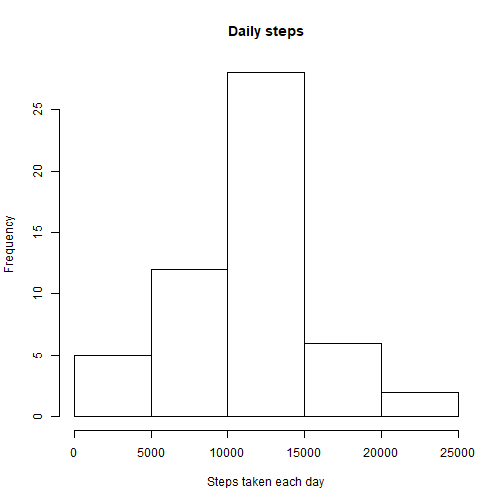
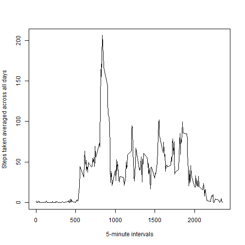
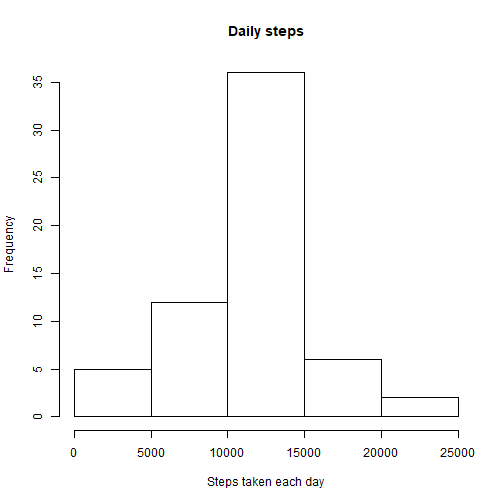
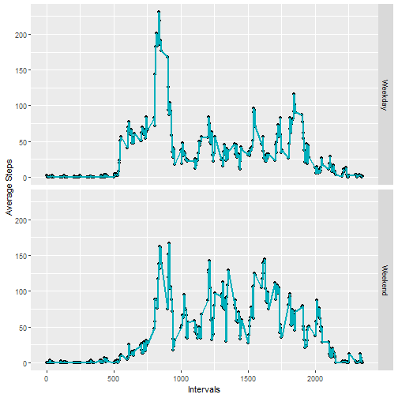

## Notes
- The markdown file was processed with the function rmarkdown::render() instead of knitr::knit2html() because the file is an R Markdown v2 document.

- The images are contained in the HTML, the engine didn't generate an extra figure/ directory


## Introduction 

This is an exploratory data analysis of information collected through wearable devices. To begin, we need to set up the environment and process the collected data


```r
filePath <- "C:\\Coursera\\Data Science\\5 2 Wearables"
filePathData <- filePath
setwd(filePathData)
act <-  read.csv("activity.csv") 
```

It is also part of this step to get the totals per day, a new data set will contain the data linked to this step; initially, the missing values will be omitted.


```r
actTotalbyDay <- aggregate(act$steps ~ act$date ,act,sum)
```


## Histogram

One of the first steps on exploratory analysis is to generate a histogram; in the following plot we can see an histogram of the steps taken each day


```r
hist(actTotalbyDay$`act$steps`, main = "Daily steps", xlab = "Steps taken each day")
```



In the previous plot, the interval between 10000 and 15000 is the one with the greatest frequency

##Mean and Median of total

The mean and median of the totals per day will help to corroborate the information in the histogram


```r
meanActByDay <- mean(actTotalbyDay$`act$steps`)
meanActByDay
```

```
## [1] 10766.19
```


```r
medianActByDay <- median(actTotalbyDay$`act$steps`)
medianActByDay
```

```
## [1] 10765
```

The mean and the media values are close and this reflects on the simmetry of the histogram.

## Average daily activity pattern

The previous section showed some of the characteristics of the data aggregated on a daily basis; this section shows another dimension of the data by aggregating it on the interval level


```r
actAvgByInterval <- aggregate(act$steps ~ act$interval ,act,FUN = mean)
plot(actAvgByInterval$`act$interval`,actAvgByInterval$`act$steps`, type = "l", ylab = "Steps taken averaged across all days ", xlab = " 5-minute intervals")
```



The previous plot shows that the maximum average is greater than 200; the R function max is used next to get the exact maximum value.


```r
maxAvgIntervals <- max(actAvgByInterval$`act$steps`)
maxAvgIntervals
```

```
## [1] 206.1698
```
##Missing Values

The calculations in all the previous sections ignored the missing (NA) values. In this section we will see if filling up the missing values makes a difference in the structure of the data.

First, we want to get the number of rows with missing values


```r
nrow(subset(act, is.na(act$steps)))
```

```
## [1] 2304
```

The number of missing rows as a percentage of the total is 


```r
nrow(subset(act, is.na(act$steps))) / (nrow(act))
```

```
## [1] 0.1311475
```

13% of the total number of observations contain missing values. 

Following, a new column will be created,in this columns the missing values will be replaced with the mean for that 5 minute interval.


```r
act <- merge(act,actAvgByInterval, by.x = "interval", by.y = "act$interval")
act$filledSteps <- ifelse(is.na(act$steps), act$`act$steps`, act$steps)
```

Next, we can create a histogram to check how filling the missing values affects the data.


```r
actFilledTotalbyDay <- aggregate(act$filledSteps ~ act$date ,act,sum)

hist(actFilledTotalbyDay$`act$filledSteps`, main = "Daily steps", xlab = "Steps taken each day")
```



The maximum frequency lies once again between the values 10000 and 15000 and no differences can be detected at first glance; next, we can calculate the mean and the median to check if they differ from the values calculated in the "Histogram" section

### Impact of missing values


```r
mean(actFilledTotalbyDay$`act$filledSteps`)
```

```
## [1] 10766.19
```

```r
median(actFilledTotalbyDay$`act$filledSteps`)
```

```
## [1] 10766.19
```


The mean was not impacted by filling the missing values; however, the median is the same as the mean which means that the data now is more symmetrical

## Activity patterns - Weekdays Vs Weekends

For the analysis in this section, a new variable is added to the data frame to find if there are any differences between weekdays and weekends. The new variable's name is dayType


```r
act$date <- as.Date(act$date)
weekend <- c("Sunday", "Saturday")
act$dayType <- ifelse(grepl(paste(weekend, collapse = "|"), weekdays(act$date)), c("Weekend"), c("Weekday"))
actAvgByIntervalDayType <- aggregate(act$filledSteps ~ act$interval + act$dayType ,act,FUN = mean)
p <- qplot(actAvgByIntervalDayType$`act$interval`,actAvgByIntervalDayType$`act$filledSteps`,data = actAvgByIntervalDayType, xlab = "Intervals", ylab = "Average Steps")  + geom_line(color = "#00AFBB", size = 1) + facet_grid(actAvgByIntervalDayType$`act$dayType` ~ .) 
print(p)
```



In this plot we can see that during the weekdays we can see the activity peak, but during the weekends we can see more activity during the whole day.

